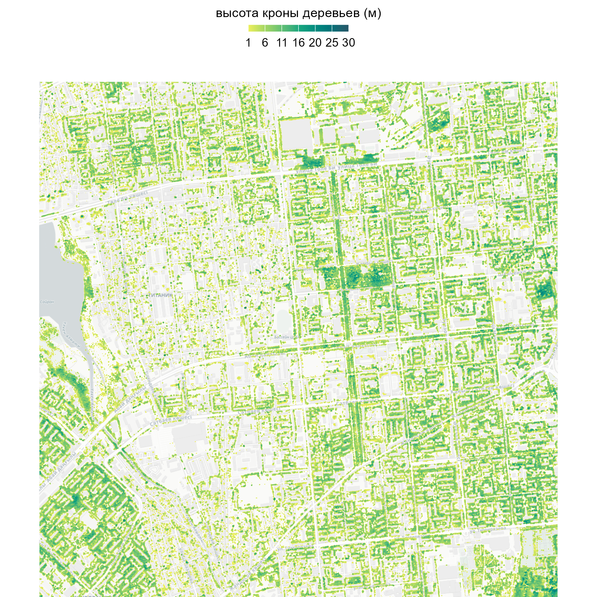
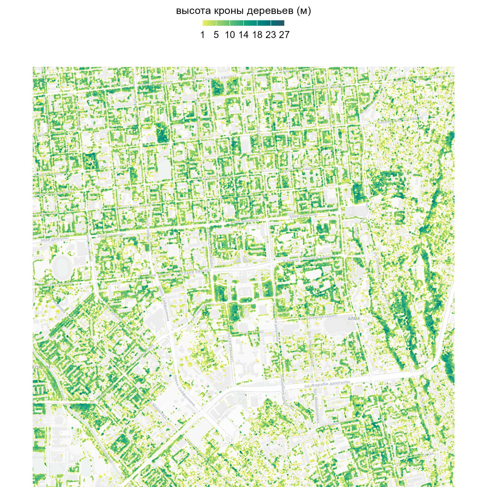
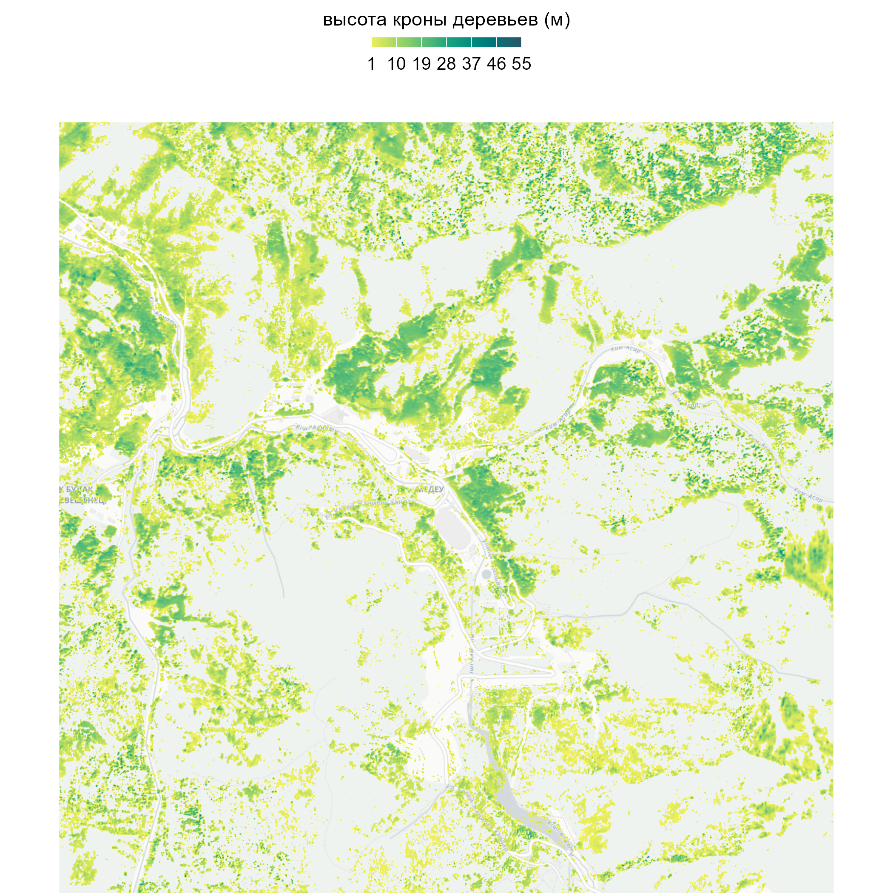

# almaty-tree-canopy-height

## the city center as a centre

I have measured the height of the crown of trees in Almaty 🌳

I developed this visualization using the R programming language using the libraries: chmloader, terra, sf, maptiles, classInt, tidyverse, tidyterra, leaflet, htmlwidgets

Context: The darker the green color on the map, the higher the tree crowns 

Canopy height is the height of the top layer of vegetation in a forest or other ecosystem, usually measured from the ground to the tops of trees or other plants. This is an important indicator in forestry, ecology and environmental research, as it can serve as an indicator of the age, condition and structure of the forest. 

Measuring the height of trees is important for several reasons:

Plant Health Assessment: Allows you to identify diseases, stressful conditions or damage.

Determining the age structure: Indicates the age of the trees, which is important for assessing their condition and care needs.

Assessment of the ecosystem role: Related to the ability of trees to capture carbon, create shade and provide shelter for animals.

Urban environment planning: Allows you to evaluate green spaces and their contribution to the urban environment.

Monitoring changes in the landscape: Tracking the growth and health of trees for sustainable management of forest and urban green areas.

## mayor office as a centre

## medeu as a centre

